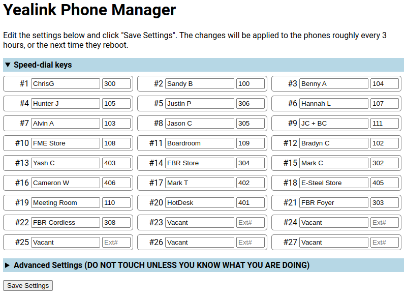

# Yealink Phone Manager
This app can be used to host and modify the config file for Yealink SIP-T46G deskphones. It is intended to be left running to provide the config file at `host:port/y000000000028.cfg`.

## Installation
Download the 'YealinkPhoneManager' folder onto the desired host machine.

## Using it

### Run the server
Simply run the binary that suits the machine its running on.
| Binary filename | Compatible machine |
|---|---|
| server_linux-amd64_bare | 64bit machines running linux |
| server_windows-386_bare.exe | 32bit machines running windows |
| server_windows-amd64_bare.exe | 64bit machines running windows |

### Use the web interface to change the configuration
When the server is running you can visit `host:port` in a web browser to modify the phone config.

The most common use for this is modifying the 'line keys' (AKA Speed-Dial keys). Once you've edited the fields as desired, clicking the 'Save Settings' button will immediately write the changes to the config file. The phones will typically retrieve and apply the new config file every 3-6 hours, as well as on boot.

> [!IMPORTANT]
> When configuring the Yealink Phone Manager & phones for the first time you may want to pay particular attention to the `static.auto_provision.server.url` setting and set it to the new url being served by Yealink Phone Manager.

### Point phones at the new config file
The phones need to be told where to look for the config file, so you'll have to edit the url to match the new address this app is providing.

For example if running on a machine with ip address 10.0.0.11 with no port specified, the phones should look at `http://10.0.0.11/y000000000028.cfg`.

## envvars (Enviroment variables):
`ADDR`: ADDR optionally specifies the TCP address for the server to listen on, in the form "host:port". If empty, ":http" (port 80) is used. The service names are defined in RFC 6335 and assigned by IANA.
*You may want to set this to a non-standard port value such as `:3000` if the host's OS doesn't allow the app to serve on port 80.*

## Notes/Suggestions
### Settings
Here are some settings you may like to customise (examples assuming the host is 10.0.0.11 and the port is http 80)
| Setting | Example | Notes |
|---|---|---|
| `wallpaper_upload.url` | http://10.0.0.11/static/my_custom_wallpaper.jpg | You can place any compatible image in the `static` folder and reference it in this setting |
| `phone_setting.backgrounds` | my_custom_wallpaper.jpg | Match the filename of the image addressed in the setting `wallpaper_upload.url` (above) |
| `push_xml.server` | | Recommend you leave this blank unless you've built a service that consumes push requests. |
| `super_search.url` | | Recommend you leave this blank unless you've built a search service. |
| `remote_phonebook.data.1.name` | | Recommend you leave this blank unless you've generated a phonebook. |
| `remote_phonebook.data.1.url` | | Recommend you leave this blank unless you've generated a phonebook. |
| `features.remote_phonebook.enable` | | Recommend you leave this blank unless you've generated a phonebook. |

> [!TIP]
> Included in the 'YealinkPhoneManager' folder is a backup of the main config file named `y000000000028.cfg.backup` - if the settings have been borked and you wish to reset them to a fresh slate you can delete the existing `y000000000028.cfg` file, copy `y000000000028.cfg.backup` and rename it to `y000000000028.cfg`.
> 
> It is strongly recommended that you overwrite this backup file with a copy of the main config file once you have configured it to a stable baseline.

### Server
Create a task/job to automatically execute the server binary on system startup. You may also want the task/job to re-start the binary if it exits.

### For end-users
Save a bookmark to the web interface for any users that want to maintain the Speed-Dial keys.
